# 🛡️ Angular Gatekeeper — Complete Technical Documentation & User Guide

> **An automated DevSecOps code quality gatekeeper, AI regression auditor, and real-time background branch conflict monitor for Angular & modern frontend development.**

---

## 📑 Table of Contents
1. [Overview](#1-overview)
2. [Key Features Breakdown](#2-key-features-breakdown)
   - [Feature A: Pre-Commit Quality & AI Validator](#feature-a-pre-commit-quality--ai-validator)
   - [Feature B: Gemini 2.5 Flash AI Knowledge Base Audit](#feature-b-gemini-25-flash-ai-knowledge-base-audit)
   - [Feature C: Live Background Branch Conflict Watcher](#feature-c-live-background-branch-conflict-watcher)
   - [Feature D: Windows Desktop Toast & Audio Alerts](#feature-d-windows-desktop-toast--audio-alerts)
   - [Feature E: 1-Click Terminal Inspector Protocol](#feature-e-1-click-terminal-inspector-protocol)
3. [Core Benefits for Developers & Teams](#3-core-benefits-for-developers--teams)
4. [How Both Engines Work Under the Hood](#4-how-both-engines-work-under-the-hood)
5. [Complete CLI Commands Reference](#5-complete-cli-commands-reference)
6. [Package & Project Structure](#6-package--project-structure)
7. [Step-by-Step Installation Guide](#7-step-by-step-installation-guide)
8. [Step-by-Step Uninstallation Guide](#8-step-by-step-uninstallation-guide)
9. [Frequently Asked Questions (FAQ)](#9-frequently-asked-questions-faq)

---

## 1. Overview

**Angular Gatekeeper** operates on your machine as a lightweight developer productivity and code-quality suite. It protects your repositories in two complementary ways:

| Shield | When It Runs | What It Does |
| :--- | :--- | :--- |
| **Pre-Commit Quality Gate** | On-demand upon typing `git commit` | Blocks broken builds, type errors, missing configurations, and AI-audits code against historical bug patterns. |
| **Live Branch Conflict Monitor** | Automatically in background (every N mins) | Detects merge conflicts against `origin/main` in real time on **live uncommitted working tree edits** without requiring commits. |

---

## 2. Key Features Breakdown

### Feature A: Pre-Commit Quality & AI Validator
Whenever you execute `git commit`, Gatekeeper intercepts the process and runs 7 sequential verification steps:
1. **Framework Auto-Detection:** Automatically inspects `package.json` for `@angular/core` or `angular.json`. If working in non-Angular repos, it safely bypasses checks without blocking.
2. **File & Configuration Integrity:** Verifies critical files (`tsconfig.json`, `src/main.ts`, `src/index.html`, `angular.json`) have not been accidentally removed.
3. **Staged-Only Inspection:** Scans only the files you are actively committing (`.ts`, `.html`, `.scss`, `.json`), keeping check times under 2–3 seconds.
4. **Strict Static Type Checking:** Executes `tsc --noEmit` to verify type safety and missing imports before code enters Git history.
5. **Security & Vulnerability Scanner:** Prevents accidental commits containing private API keys, secrets, or insecure direct DOM access (`nativeElement.innerHTML`).
6. **Angular Architecture Check:** Verifies clean RxJS subscriptions (`takeUntilDestroyed()`) and proper component imports.
7. **Gatekeeper Verdict:** Approves clean commits or blocks broken commits with line numbers, code snippets, and corrective advice.

---

### Feature B: Gemini 2.5 Flash AI Knowledge Base Audit
- **Institutional Memory:** Reads your project's historical `resolved_issues.md` knowledge base.
- **Zero Regressions:** Gemini 2.5 Flash analyzes your incoming code diff to ensure bugs fixed in the past are never accidentally reintroduced.
- **Optional Setup:** If no Gemini API key is provided, this step safely skips while all other local checks run at 100% capacity.

---

### Feature C: Live Background Branch Conflict Watcher
- **No Commit Required:** Uses `git stash create` to take an in-memory snapshot of your active working tree (staged + unstaged live edits) without touching your disk or Git stash list.
- **In-Memory 3-Way Merge (`git merge-tree`):** Simulates what will happen when your branch merges into `origin/main` in real time.
- **Custom Timer:** Configurable check interval (e.g., every 1 minute, 5 minutes, 15 minutes).
- **Completely Silent Execution:** All background checks run with `windowsHide: true`, ensuring zero black terminal windows flash while you code.

---

### Feature D: Windows Desktop Toast & Audio Alerts
- Displays a native notification card in the bottom-right corner of Windows with an audio chime when a conflict is detected on GitHub.
- Works across Windows 10 and Windows 11.

---

### Feature E: 1-Click Terminal Inspector Protocol
- Clicking the notification card or the **"🔍 View Details"** button invokes the registered `gatekeeper-details:` protocol to launch a Command Prompt window.
- The terminal displays your current branch, target branch, new remote commits, and the conflicting files so you can run `git pull origin main` or resolve them immediately.

---

## 3. Core Benefits for Developers & Teams

| Problem | How Gatekeeper Solves It |
| :--- | :--- |
| **Painful Pull Request Conflicts** | Detects merge conflicts in real time while you code so you can rebase immediately instead of spending hours resolving conflicts days later. |
| **Déjà Vu / Recurring Bugs** | AI checks your code against `resolved_issues.md` to guarantee that previously resolved bugs never reappear. |
| **Senior Engineer Burnout** | Automates repetitive PR review tasks (RxJS memory leak detection, architecture validation, type checking). |
| **Broken Builds in CI/CD** | Stops syntax errors, missing imports, and type mismatches before code is committed. |
| **Junior Developer Mentorship** | Explains *why* a pattern failed and *how* to fix it directly in terminal output. |
| **Zero Setup Headaches** | Packaged as a standalone Windows executable—no global Node.js runtime required. |

---

## 4. How Both Engines Work Under the Hood

### Architecture Flowchart:

```mermaid
flowchart TD
    subgraph "Pre-Commit AI Quality Engine"
        A["Developer types: git commit"] --> B["Step 1: Detect Project Type"]
        B -->|Non-Angular| C["Safe Bypass ✔"]
        B -->|Angular| D["Step 2: File Integrity Check"]
        D --> E["Step 3: Staged Changes Scan"]
        E --> F["Step 4: TypeScript Static Compilation (tsc)"]
        F -->|Type Errors| G["Block Commit ✖"]
        F -->|Pass| H["Step 5: Angular Best Practices & Security"]
        H --> I["Step 6: Gemini 2.5 Flash AI Regression Audit"]
        I --> J["✔ Commit Approved & Saved"]
    end

    subgraph "Background Live Conflict Watcher"
        K["Interval Timer Triggers (e.g. 1m / 15m)"] --> L["1. git fetch origin <target-branch>"]
        L --> M["2. git stash create (In-Memory Live Edits Snapshot)"]
        M --> N["3. git merge-tree (Dry-Run 3-Way Merge)"]
        N -->|Zero Conflicts| O["Silent Sleep until next cycle"]
        N -->|Conflicts Found| P["4. Windows Desktop Toast Alert + Sound"]
        P -->|User Clicks Notification| Q["5. Launch Terminal: Show Conflicting Files"]
    end
```



---

## 5. Complete CLI Commands Reference

All commands start with `a-gatekeeper`:

### 🛡️ Pre-Commit Hook Commands
```bash
# Enable pre-commit quality gate in current repository
a-gatekeeper enable

# Disable pre-commit quality gate (revert to normal git commit)
a-gatekeeper disable

# Check if pre-commit quality gate is active
a-gatekeeper status
```
*Works seamlessly with GitHub Desktop, Git CLI, Git Bash, VS Code, WebStorm, Cursor, and IntelliJ.*

---

### 🌿 Live Branch Conflict Watcher Commands
```bash
# Start interactive branch conflict monitor (prompts for target branch & interval)
a-gatekeeper branch check --enable

# View live background status, active PID, and conflicting files
a-gatekeeper branch check --status

# Stop background conflict monitor for current repository
a-gatekeeper branch check --disable
```

---

## 6. Package & Project Structure

### Release Software Package (`Angular Gatekeeper/`):
```text
Angular Gatekeeper/
├── 🚀 AngularGatekeeperSetup.exe   # Standalone Setup Wizard (Install & Uninstall)
├── ⚙️ engine.exe                   # Core background daemon & validator
├── 🖱️ Install.bat                  # 1-Click Setup Launcher
├── 🗑️ Uninstall.bat                # 1-Click Uninstaller
├── 📄 README.txt                   # Plaintext User Guide
└── 📄 README.md                    # Markdown User Guide
```

### Source Code Repository (`ValidatorAgent/`):
```text
ValidatorAgent/
├── Angular Gatekeeper/             # Distribution folder
├── build/                          # Bundled CommonJS outputs (esbuild)
├── src/                            # Source code (ES Modules)
│   ├── branch-watcher.js           # Live conflict monitor & Windows Toast engine
│   ├── engine.js                   # CLI router, pre-commit validator & Gemini AI audit
│   ├── installer.js                # System setup & uninstaller wizards
│   ├── rules/                      # Static rules (TypeScript, Angular, Security)
│   └── utils/                      # Shell execution & terminal helpers
├── build.js                        # Multi-target compiler (esbuild + pkg)
└── package.json                    # Dependencies and build scripts
```

---

## 7. Step-by-Step Installation Guide

### Step 1: Run the Installer
1. Open the `Angular Gatekeeper/` folder.
2. Double-click **`Install.bat`** (or **`AngularGatekeeperSetup.exe`**).

### Step 2: Configure API Key (Optional)
- When prompted: `Enter your Google AI (Gemini) API Key (Press Enter to skip):`
  - Enter your API Key to enable AI Knowledge Base audits.
  - Or press **`[Enter]`** to install standard checks without AI.

### Step 3: Start Using
The installer automatically:
- Copies `engine.exe` to `%APPDATA%\FrontendGatekeeper`.
- Adds `a-gatekeeper` to your system User PATH.
- Configures the Windows notification click protocol.
- Restart your terminal (CMD, PowerShell, Git Bash, or VS Code) to start using commands!

---

## 8. Step-by-Step Uninstallation Guide

To completely remove Angular Gatekeeper:
1. Open the `Angular Gatekeeper/` folder.
2. Double-click **`Uninstall.bat`** (or run `AngularGatekeeperSetup.exe --uninstall`).
3. Press **`Y`** and **`[Enter]`** to confirm.
4. **All background processes, hooks, system PATH entries, and configurations are cleaned up immediately.**

---

## 9. Frequently Asked Questions (FAQ)

#### Q1: Does the Branch Conflict Watcher require me to commit my code?
**No.** It uses `git stash create` to take an in-memory snapshot of your live, uncommitted working edits. You can be actively typing code and it will still detect remote conflicts.

#### Q2: Is the Gemini AI API Key mandatory?
**No.** The API key is 100% optional. If you do not provide a key, all TypeScript checks, Angular best practice validations, and the Branch Conflict Watcher work at full capacity.

#### Q3: Does Angular Gatekeeper work with GUI tools like GitHub Desktop?
**Yes.** Because it installs standard Git hooks (`core.hooksPath`), any commit made via GitHub Desktop, VS Code, Git CLI, WebStorm, or Cursor is automatically validated.

#### Q4: Will background checks interrupt my work with popups?
**No.** Background conflict checking runs silently with `windowsHide: true`. A notification only appears when an actual merge conflict is detected on GitHub.
